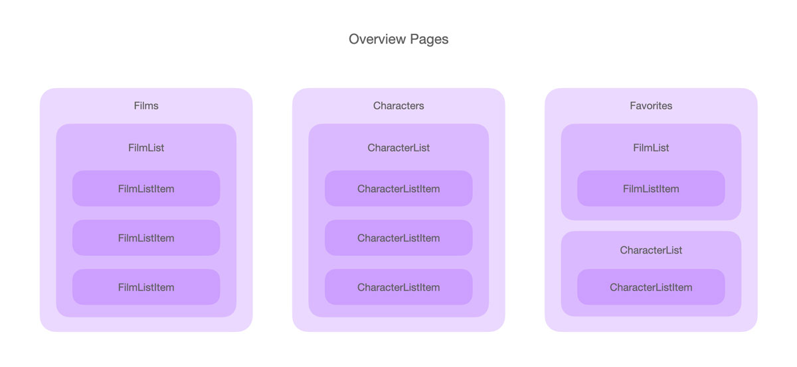
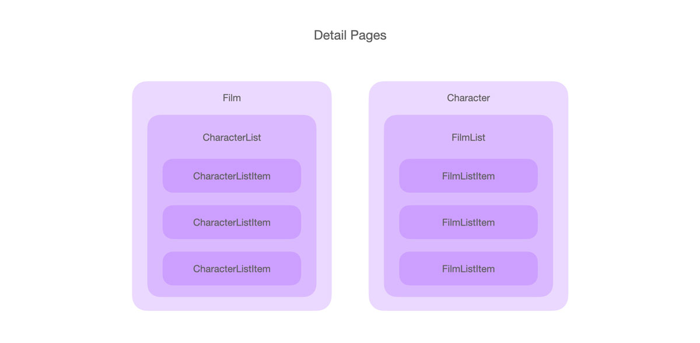

# SWAPI React App

A Star Wars API demo app using React (Create React App) and Tailwind CSS.

## Features

This Star Wars web app contains the following overview pages that can be reached from the top navigation:

- `Films`: See a list of Star Wars films and add any to your favorites
- `Characters`: See a list of Star Wars characters and add any to your favorites
- `Favorites`: See a list of your favorite Star Wars films and characters (work in progress)

By selecting either a film or a character, you enter the detail pages:

- `Film`: Learn more about this film and see a list of its characters
- `Character`: Learn more about this character and see a list of its films

## Getting Started

### Development

```sh
# Install dependencies
npm install

# Run the app in development mode
npm start
```

Then open [http://localhost:3000](http://localhost:3000) to view it in the browser.

### Testing

This project uses [react-testing-library](https://github.com/testing-library/react-testing-library) for unit testing.

Tests can be found in the `src/__tests__` folder.

```
# Run tests in watch mode
npm test
```

### Production

To prepare the app for production deployment, run the following command:

```sh
# Build app for production
npm run build
```

It correctly bundles React in production mode and optimizes the build for the best performance. You can find the result in the `build` folder.

## Architecture

The app mainly contains of the following chomponents:

### Overview Pages



- `Films`, including `FilmList`
- `Characters`, including `CharacterList`
- `Favorites`, including both `FilmList` and `CharacterList`

### Detail Pages



- `Film`, including `CharacterList`
- `Character`, including `FilmList`

### Lists

The list components each have their own item component (`CharacterListItem` and `FilmListItem`) that includes the `HeartButton` component for selecting favorites.
